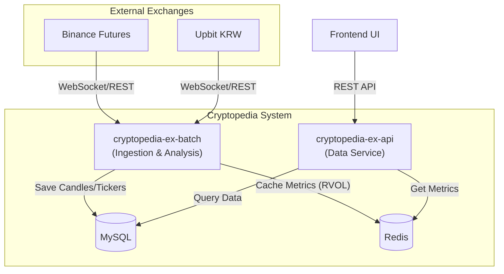

# Cryptopedia

Cryptopedia는 암호화폐 시장의 방대한 데이터를 분석하여 투자자에게 유의미한 인사이트와 실시간 시장 흐름을 제공하는 지능형 데이터 플랫폼입니다.

## Architecture

## Tech Stack

- **Language**: Kotlin 2.0
- **Framework**: Spring Boot 3.4
- **Persistence**: MySQL 8.0, Spring Data JPA
- **Caching**: Redis
- **Networking**: Spring Cloud OpenFeign, OkHttp (WebSocket)
- **Documentation**: Springdoc OpenAPI (Swagger)
- **Build**: Gradle

