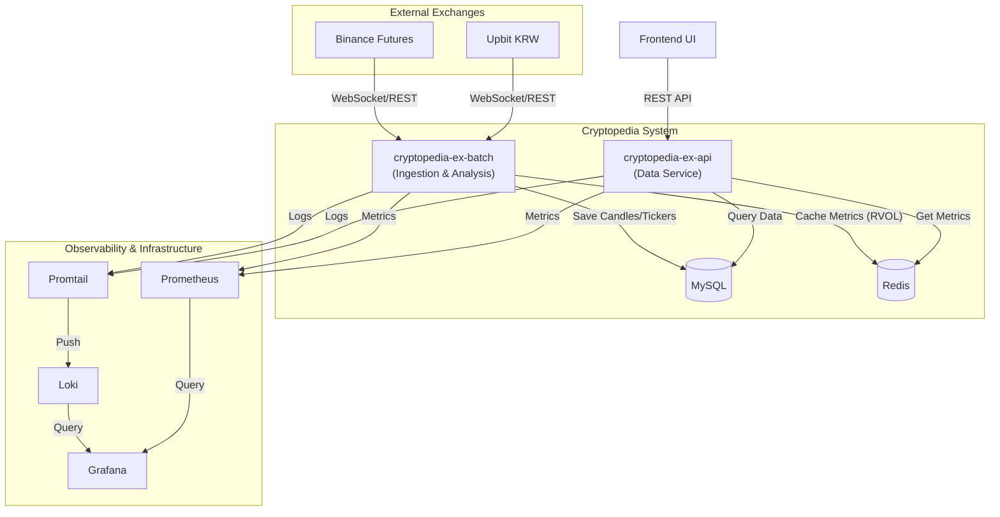
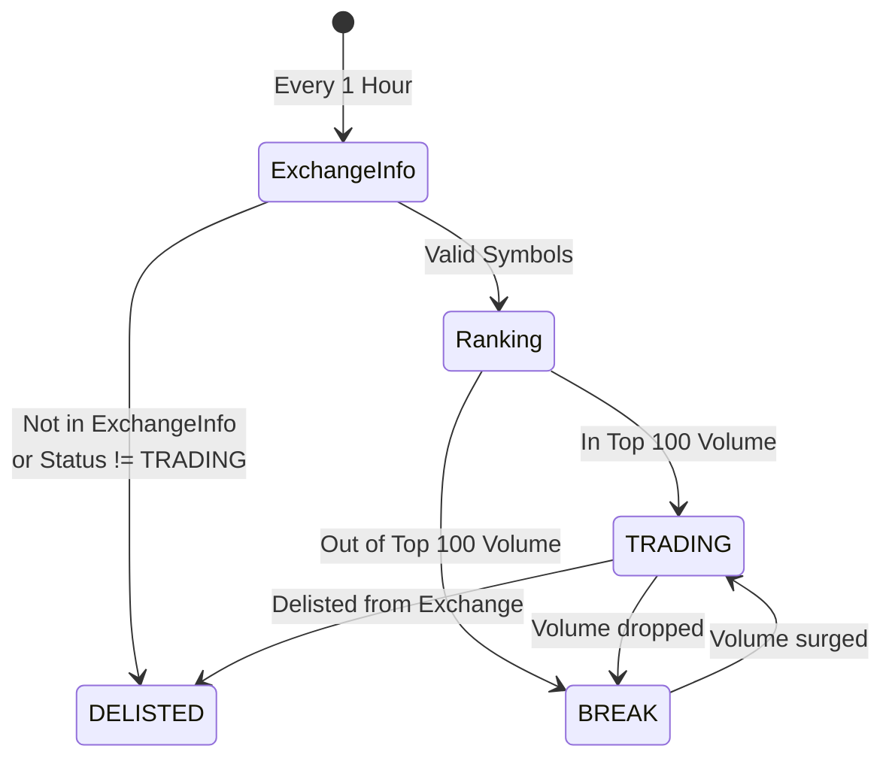
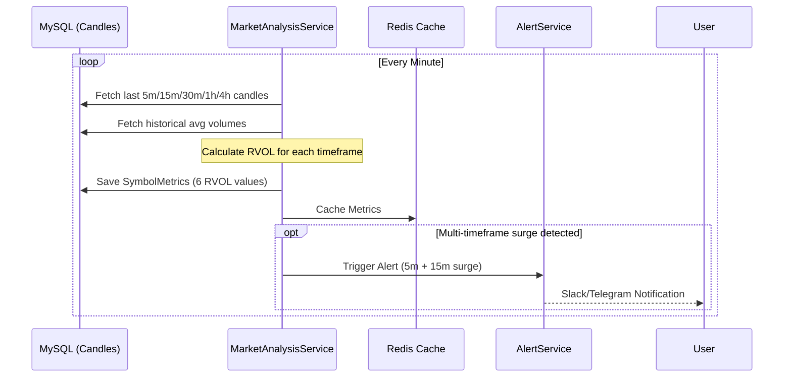

# Cryptopedia

Cryptopedia는 암호화폐 시장의 방대한 데이터를 분석하여 투자자에게 유의미한 인사이트와 실시간 시장 흐름을 제공하는 지능형 데이터 플랫폼입니다.

## Architecture



## Tech Stack

- **Language**: Kotlin 2.0
- **Framework**: Spring Boot 3.4
- **Persistence**: MySQL 8.0, Spring Data JPA
- **Caching**: Redis
- **Networking**: Spring Cloud OpenFeign, OkHttp (WebSocket)
- **Documentation**: Springdoc OpenAPI (Swagger)
- **Build**: Gradle

## 🏗️ Symbol Lifecycle Management

시장 상황(상장 폐지, 거래량 변화)에 따라 수집 대상을 동적으로 관리하여 데이터 무결성을 유지합니다.

### Symbol Status
| 상태 | 설명 | 데이터 수집 |
| :--- | :--- | :--- |
| **TRADING** | 거래량 상위 100위 이내의 활성 심볼 | **진행 (WS/API)** |
| **BREAK** | 거래소에 존재하나 100위권 밖으로 밀려난 상태 | 중단 (데이터 보존) |
| **DELISTED** | 거래소에서 제거되었거나 상장 폐지된 상태 | 영구 제외 |

### Sync Workflow


## 📈 Multi-Timeframe RVOL System

RVOL(Relative Volume)은 과거 평균 거래량 대비 현재 거래량의 비율로, **단타 트레이딩에 최적화된 다중 타임프레임 시스템**을 제공합니다.

### Timeframe Structure

| 타임프레임 | 용도 | 트레이딩 스타일 | 임계값 예시 |
|:---|:---|:---|:---|
| **1분** | 초고속 급등 감지 | 세력 매집 포착 | > 8.0 |
| **5분** | 초단타 진입 시그널 | 스캘핑 (1~5분) | > 5.0 |
| **15분** | 단타 확인 | 단타 (10~30분) | > 3.0 |
| **30분** | 단기 추세 확인 | 데이 트레이딩 (30분~2시간) | > 2.5 |
| **1시간** | 중기 추세 | 스윙 (2~6시간) | > 2.0 |
| **4시간** | 일중 큰 흐름 | 당일 청산 | > 1.8 |
| **Today** | 오늘 전체 | 참고용 | > 1.5 |

### Calculation Logic

각 타임프레임별로 독립적으로 계산됩니다:

1.  **실제 거래량**: 해당 타임프레임 동안의 누적 거래량
2.  **예상 거래량**: 과거 30일 동일 시간대 평균 거래량
3.  **RVOL**: `실제 거래량 / 예상 거래량`

```
RVOL_5m = Volume(최근 5분) / AvgVolume(과거 30일 동일 5분)
RVOL_15m = Volume(최근 15분) / AvgVolume(과거 30일 동일 15분)
...
```

### Trading Scenarios

#### 초단타 진입 (1~5분)
```kotlin
if (rvol_1m > 8.0 && rvol_5m > 5.0) {
    // 지금 막 터지는 중! 즉시 진입
}
```

#### 단타 확인 (10~30분)
```kotlin
if (rvol_1m > 6.0 && rvol_5m > 4.0 && rvol_15m > 3.0) {
    // 다중 타임프레임 확인, 강력한 진입
}
```

#### 청산 시그널
```kotlin
if (rvol_1m < 1.0 && rvol_5m < 1.0 && profit > 2.0%) {
    // 거래량 소멸, 익절 청산
}
```

### Data Flow Sequence



