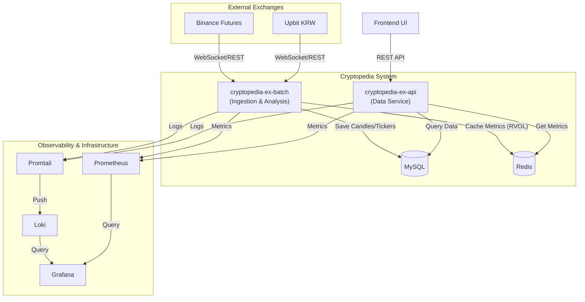
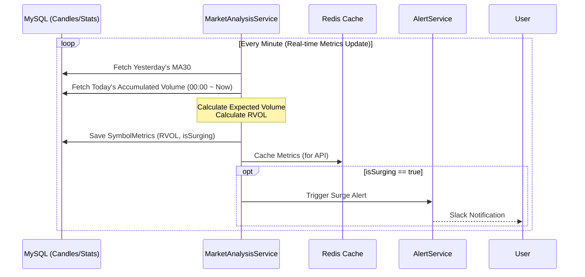

# Cryptopedia

Cryptopedia는 암호화폐 시장의 방대한 데이터를 분석하여 투자자에게 유의미한 인사이트와 실시간 시장 흐름을 제공하는 지능형 데이터 플랫폼입니다.

## Architecture

## Tech Stack

- **Language**: Kotlin 2.0
- **Framework**: Spring Boot 3.4
- **Persistence**: MySQL 8.0, Spring Data JPA
- **Caching**: Redis
- **Networking**: Spring Cloud OpenFeign, OkHttp (WebSocket)
- **Documentation**: Springdoc OpenAPI (Swagger)
- **Build**: Gradle

## 📈 RVOL (Relative Volume) Calculation

RVOL은 과거 평균 거래량 대비 현재 거래량의 비율을 나타내며, 시장의 이상 거래 징후를 탐지하는 핵심 지표입니다.

### Calculation Logic
1.  **Baseline (Daily MA30)**: 지난 30일간의 일일 평균 거래량(**MA**: Moving Average, 이동 평균)을 기준으로 사용합니다.
2.  **Expected Volume**: 현재 시간(UTC)을 기준으로 오늘 하루 동안 발생할 것으로 예상되는 거래량을 계산합니다.
    - $ExpectedVolume = DailyMA30 \times \frac{ElapsedMinutes}{1440}$
3.  **RVOL Formula**: 현재까지 누적된 거래량을 예상 거래량으로 나눕니다.
    - $RVOL = \frac{CurrentAccumulatedVolume}{ExpectedVolume}$
4.  **Surge Detection**: RVOL이 **1.5 (150%)**를 초과하면 이상 급등(`isSurging = true`)으로 판단합니다.

### Data Flow Sequence

