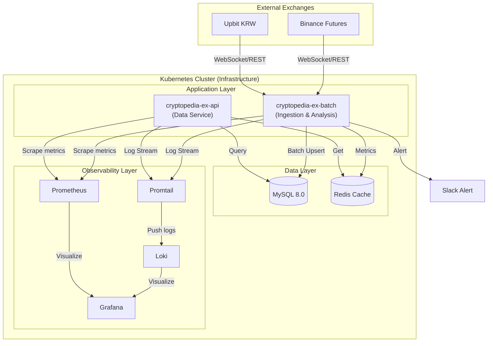

# Cryptopedia (크립토피디아)

**Cryptopedia**는 암호화폐 시장의 방대한 데이터를 실시간으로 분석하여 투자자에게 유의미한 인사이트와 시장의 이상 흐름을 즉각적으로 제공하는 **지능형 데이터 분석 플랫폼**입니다.

## 🌟 Service Summary

- **실시간 거래량 급등(RVOL) 탐지**: 과거 데이터 기반의 예측 모델을 통해 현재 거래량이 비정상적으로 터지는 종목을 초 단위로 감지합니다.
- **다중 타임프레임 분석**: 1분봉부터 4시간봉까지 다양한 관점에서 시장의 에너지를 분석하여 단타부터 스윙까지 최적의 진입 시점을 제안합니다.
- **시장 이상 징후 알림**: 급격한 가격 변동이나 거래량 폭발 시 슬랙(Slack) 등 협업 도구로 실시간 푸시 알림을 발송합니다.
- **데이터 기반의 의사결정**: 단순 가격 차트를 넘어, 수치화된 상대 거래량 지표를 통해 감정이 배제된 객관적인 투자 판단을 돕습니다.

## 🏗️ Total Infrastructure Architecture

시스템의 안정성과 확장성을 위해 구축된 전체 인프라 및 데이터 흐름도입니다. 로그 수집 및 메트릭 모니터링 체계를 포함합니다.

## 📖 Detailed Documentation

서비스의 내부 동작 원리 및 기술적 상세 구현 내용은 아래 문서를 참고하세요.

- [**System Architecture**](./docs/system-architecture.md): 상세 모듈 구조 및 심볼 생명주기 관리
- [**Data Ingestion Pipeline**](./docs/data-ingestion-pipeline.md): 웹소켓 버퍼링, 배치 업서트 및 자동 복구(Backfill) 기술 상세
- [**RVOL Calculation Logic**](./docs/rvol-calculation.md): 거래량 급등 탐지 알고리즘 및 다중 타임프레임 정의

---

## 🛠 Tech Stack

- **Backend**: Kotlin 2.0, Spring Boot 3.4
- **Database**: MySQL 8.0 (Persistence), Redis (Caching)
- **Infra**: Kubernetes, Helm, Docker
- **Monitoring**: Prometheus, Grafana, Loki, Promtail
- **Communication**: Slack API (Alerting)

