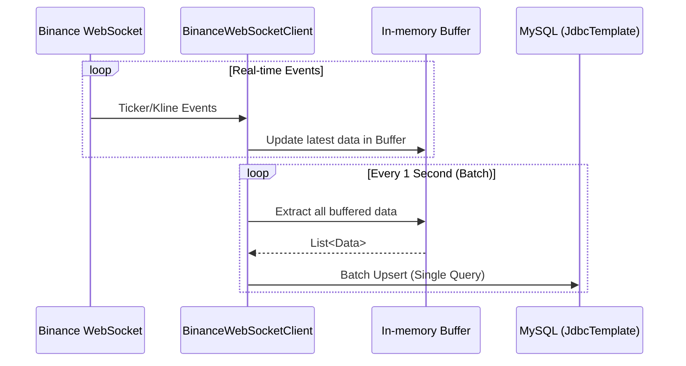

# Data Ingestion Pipeline

Cryptopedia는 초당 수천 건의 마켓 이벤트를 손실 없이, 낮은 지연 시간으로 처리하기 위해 최적화된 파이프라인을 구축했습니다.

## 🌊 In-memory Buffering & Batch Upsert

웹소켓을 통해 들어오는 개별 이벤트(Ticker, Kline)를 즉시 DB에 쓰지 않고 버퍼링을 거쳐 벌크로 처리합니다.

### 1. Ticker / Kline Buffering
- **Mechanism**: `ConcurrentHashMap`을 사용하여 실시간 데이터를 메모리에 유지.
- **Deduplication**: 동일한 심볼/시간대의 데이터가 들어올 경우 최신본으로 덮어쓰기하여 최종 상태만 보관.
- **Interval**: 1초 주기로 스케줄러가 버퍼를 비우고(Flush) DB 저장 로직 호출.

### 2. MySQL Native Batch Upsert
- **Performance**: JPA의 `save()` 대신 `JdbcTemplate`과 MySQL의 `ON DUPLICATE KEY UPDATE` 구문을 사용.
- **Optimization**: 초당 수백 건의 개별 쿼리를 단 1회의 벌크 쿼리로 통합하여 DB 부하를 획기적으로 감소.

## 🛡 Resilient Startup Backfill

배치 서버가 재시작되거나 점검으로 인해 중단되었을 때, 데이터의 연속성을 보장하기 위한 자동 복구 메커니즘입니다.

### 1. Gap Detection
- 애플리케이션 시작 시(DataCollectionInitializer), 각 심볼별로 DB에 저장된 마지막 캔들 시점(`openTime`)을 확인.
- 현재 시간과의 차이를 계산하여 공백 구간을 특정.

### 2. REST API Backfill
- 공백이 1분 이상일 경우, 바이낸스 REST API(`getKlines`)를 호출하여 누락된 구간의 캔들 데이터를 즉시 수집.
- 복구가 완료된 후에만 실시간 웹소켓 연결을 시작하여 데이터의 정합성을 보장.

## 🔄 Data Flow Detail

