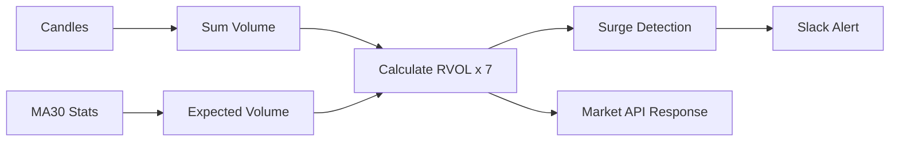

# RVOL Calculation Logic

RVOL(Relative Volume)은 특정 시점의 거래량이 과거 평균 대비 얼마나 이례적인지를 나타내는 지표로, Cryptopedia의 이상 징후 탐지 핵심 알고리즘입니다.

## 📈 Multi-Timeframe RVOL

단일 지표의 한계를 극복하기 위해 단기부터 중장기까지의 7개 타임프레임을 동시에 분석합니다.

| 타임프레임 | 용도 | 분석 관점 |
|:---|:---|:---|
| **1분** | 초고속 급등 감지 | 세력 매집 및 펌핑 초기 포착 |
| **5분** | 초단타 진입 시그널 | 거래량 실린 돌파 확인 |
| **15분** | 단타 신뢰도 확인 | 추세 형성 여부 판단 |
| **30분 / 1시간** | 중기 추세 분석 | 안정적인 추세 추종 |
| **4시간** | 일중 대형 흐름 포착 | 고래들의 움직임 감지 |
| **Today** | 당일 전체 거래 강도 | 오늘 하루의 시장 주도주 확인 |

## 🧮 알고리즘 상세

### 1. Baseline (Daily MA30)
- 지난 30일간의 일일 평균 거래량을 기준점(100%)으로 설정합니다.
- `DailyMA30 = (Day1 + Day2 + ... + Day30) / 30`

### 2. Time-Weighted Expected Volume
- 현재 시간(UTC)을 기준으로 오늘 하루 중 어느 정도 시간이 흘렀는지를 반영하여 예상 거래량을 계산합니다.
- `ExpectedVolume = DailyMA30 * (ElapsedMinutes / 1440)`

### 3. 타임프레임별 RVOL 계산
- **1분/5분/15분 등**: 해당 구간의 누적 거래량을 MA30 기반의 기대값으로 나눕니다.
- `RVOL_5m = CurrentVolume(5m) / (DailyMA30 * (5 / 1440))`

## 🚨 Surge Detection Scenarios

### 1. 초기 매수세 확인 (VAP)
거래량이 폭발하면서 가격이 동시에 상승하는 경우를 감지합니다.
```kotlin
// 1m RVOL이 평소보다 8배 이상, 5m가 4배 이상일 때
isSurging = rvol1m > 8.0 && rvol5m > 4.0 && priceChangePercent > 0
```

### 2. 다중 컨펌 (Confirmation)
여러 타임프레임에서 동시에 거래량이 터질 때 신뢰도가 급격히 상승합니다.
- 1m, 5m, 15m RVOL이 모두 임계치를 넘는 경우 강력한 알림 발송.

## 📊 Data Analytics Flow


