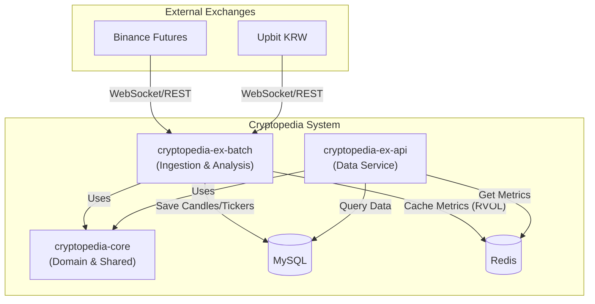

# System Architecture

Cryptopedia는 실시간 데이터 수집, 분석, 제공을 위해 모듈화된 아키텍처를 가집니다.

## 🏗 전체 구조

## 📦 모듈별 역할

### 1. cryptopedia-core
- **Entity & Repository**: 모든 모듈에서 사용하는 공통 도메인 모델(Symbol, Candle1m, SymbolMetrics 등) 및 JPA/JDBC Repository 정의.
- **Client**: 외부 거래소(Binance 등)와의 통신을 위한 Feign Client 및 공통 설정.
- **Shared Utils**: 공통 예외 처리, 응답 포맷, 유틸리티 클래스.

### 2. cryptopedia-ex-batch
- **MarketDataIngestion**: WebSocket을 통한 실시간 데이터 수집 및 고속 저장 로직.
- **MarketAnalysis**: 수집된 데이터를 바탕으로 RVOL 지표 계산 및 이상 급등 감지.
- **SymbolSync**: 거래소의 상장 심볼 정보를 주기적으로 동기화하고 거래량 기반 수집 대상 관리.
- **Alerting**: 이상 징후 감지 시 Slack 등으로 알림 발송.

### 3. cryptopedia-ex-api
- **Market API**: 실시간 티커, 캔들 데이터, RVOL 지표 조회 엔드포인트 제공.
- **Signup API**: 사용자 가입 신청 및 관리 기능.
- **Common Response**: 모든 API에 대해 일관된 Lean Response 포맷 적용.

## 🏗 Symbol Lifecycle Management

시장 상황(상장 폐지, 거래량 변화)에 따라 수집 대상을 동적으로 관리하여 데이터 무결성을 유지합니다.

### Symbol Status
| 상태 | 설명 | 데이터 수집 |
| :--- | :--- | :--- |
| **TRADING** | 거래량 상위 100위 이내의 활성 심볼 | **진행 (WS/API)** |
| **BREAK** | 거래소에 존재하나 100위권 밖으로 밀려난 상태 | 중단 (데이터 보존) |
| **DELISTED** | 거래소에서 제거되었거나 상장 폐지된 상태 | 영구 제외 |
